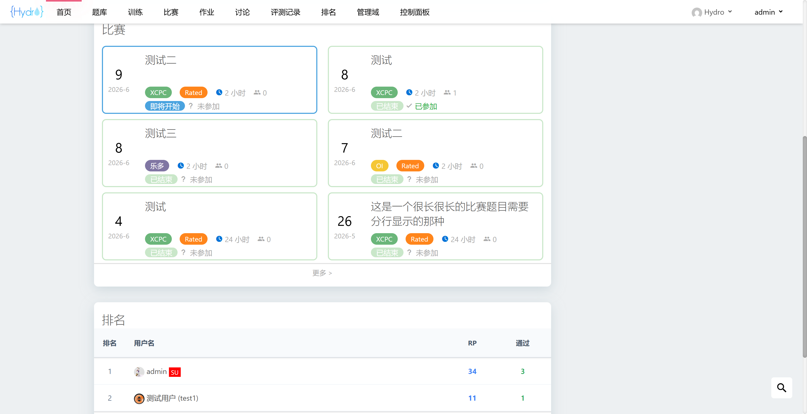
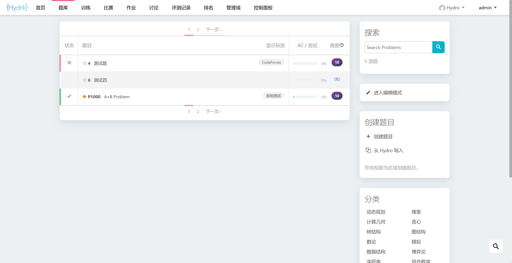
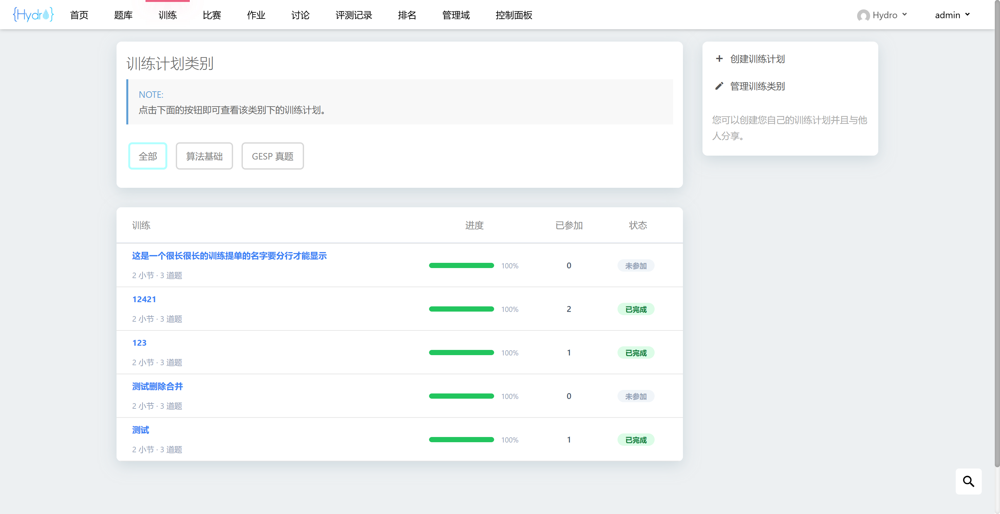
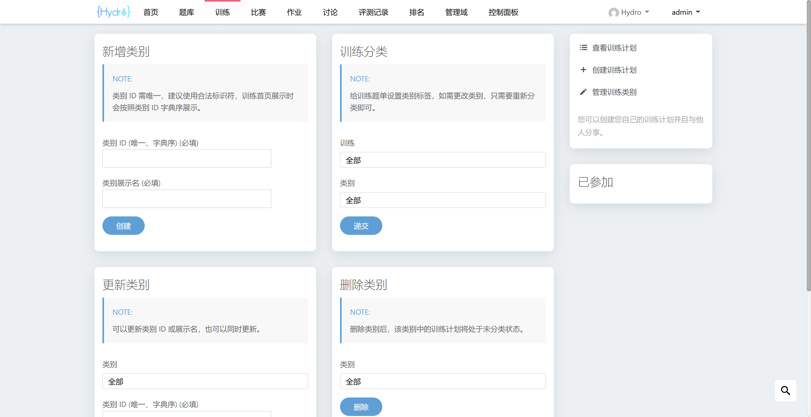
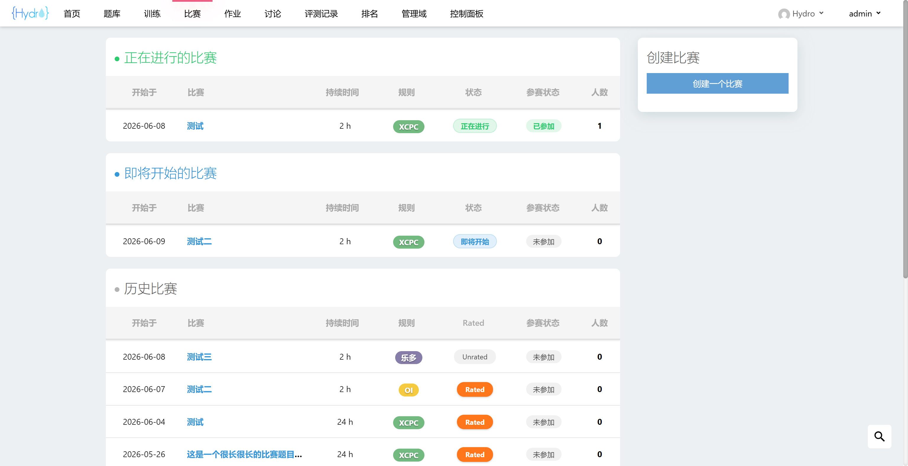
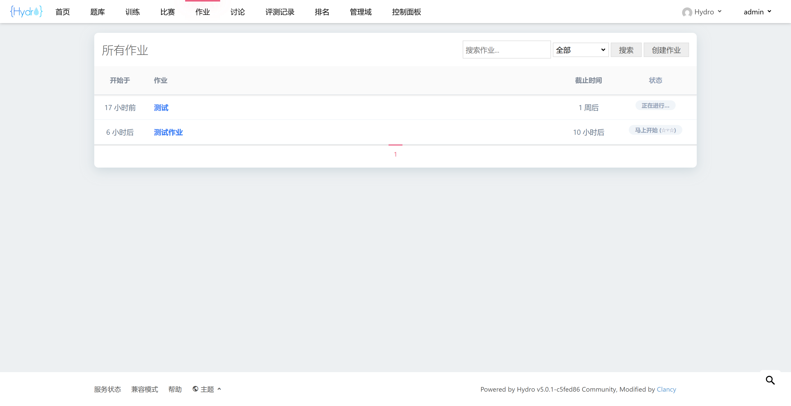
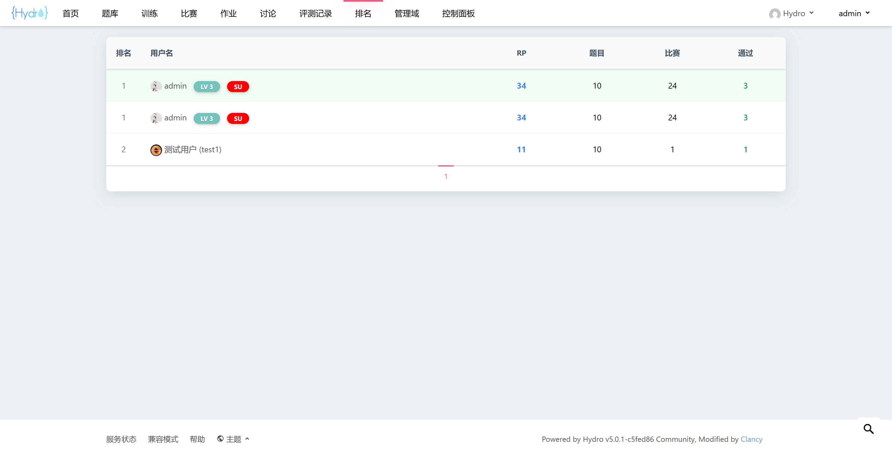
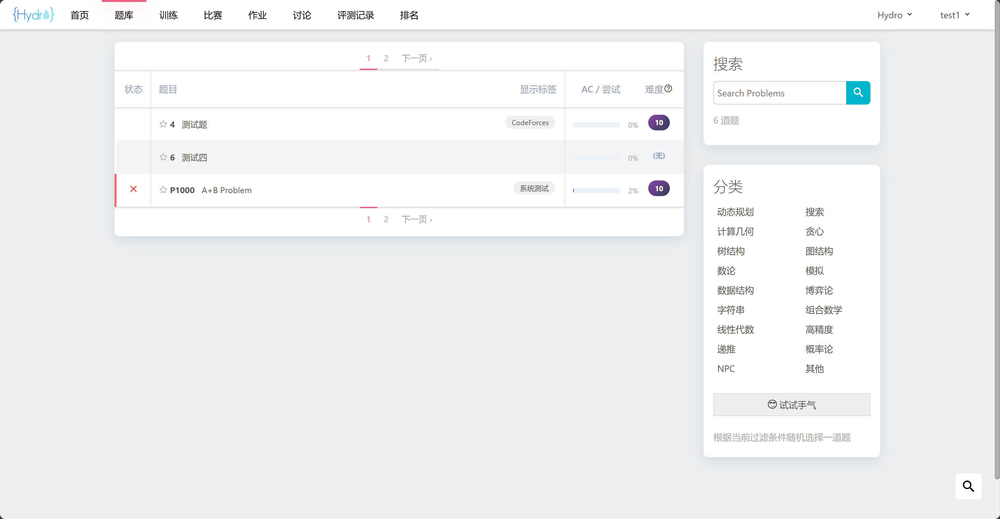
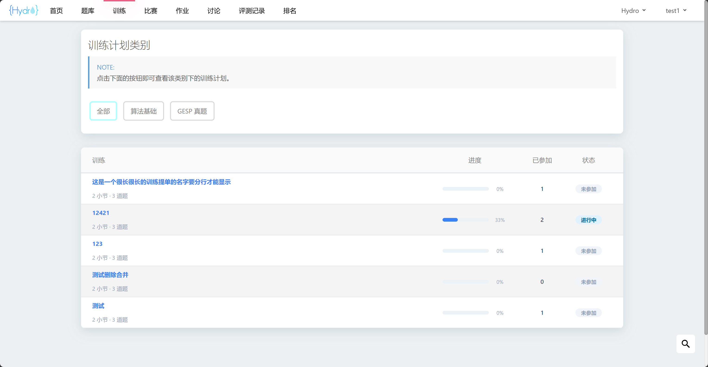
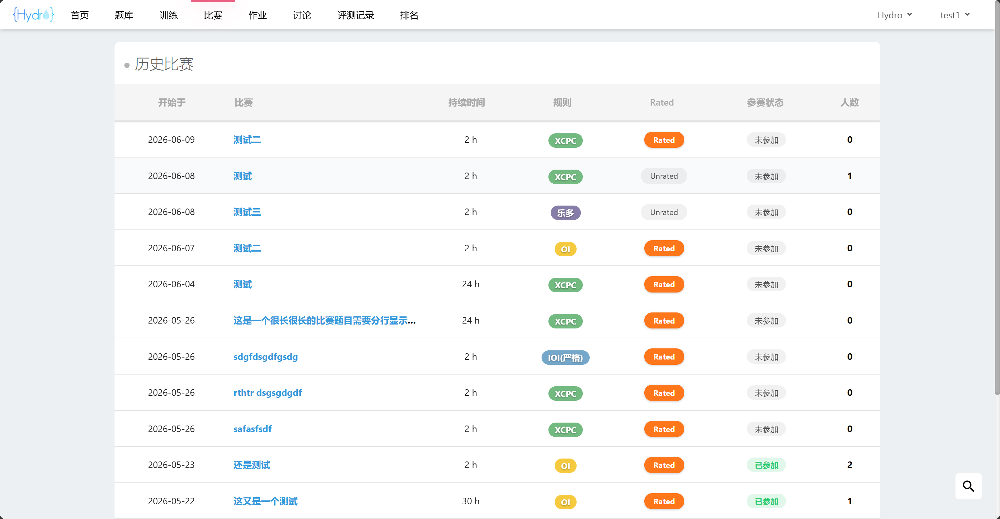

# Hydro 前端修改插件

兼容 V5.0.1 社区版，不依赖任何额外插件和第三方库，安装方法见官方文档。

`/img` 中是 `README.md` 的截图，安装时可以放心删除。

## 微小调整，仅涉及前端渲染

微整容：
1. 调整了 Nav 的宽度，避免在代码编辑页面点击【自测】时误点用户名。
2. 调整了创建题目的模板，换成了中文模板。
3. 简化了页脚，仅保留【服务状态】、【兼容模式】、【帮助】和【主题】四个选项，减少页脚高度。
4. 简化了帮助页信息，仅保留【评测状态】、【编译错误】、【比赛】、【RP 算法】、【难度算法】和【Markdown】。
5. 取消了上传头像功能，仅保留获取 QQ 头像的功能。

小整容：
1. 美化了首页【比赛】展示选项卡，界面参考洛谷首页近期比赛展示选项卡。
2. 美化了首页【排名】展示选项卡，去掉了个人简介，加入了通过题目数量和等级徽章的显示。
3. 美化了题目列表页，简化了状态栏信息，添加了通过率显示。搜索框移到了右侧边栏，去掉了排序选项，普通用户去掉了编辑模式。
4. 美化了比赛列表页，分为【正在进行】、【即将开始】、【历史比赛】三个板块从上到下展示，如果对应列表为空则不展示相应板块。比赛列表采用类似题目列表的紧缩展示方式，取消了搜索框和过滤条件。拓宽了普通用户的比赛列表宽度，填补右侧边栏的空白。
5. 美化了作业列表页，取消了日历视图的切换，作业列表与比赛列表展示方式一致。
6. 美化了排名列表页，去掉了个人简介，加入了通过题目数量的显示，强化了当前登录用户的排名底色和交互色。

## 大型整容，涉及新增数据表

调整了训练题单的展示页，灵感来自 HOJ 训练展示页。增加了训练分类功能，任意用户均可在训练首页按照训练类别进行筛选，默认展示所有训练题单。调整了训练列表的展示形式，参加状态和完成度显示在列表中，去掉了右侧【已参加】选项卡，拓宽了普通用户的训练列表宽度，填补右侧边栏的空白。

拥有 `PERM_CREATE_TRAINING` 权限的用户可以管理训练分类，主要功能如下：

1. 新增类别：必须设置类别 ID 和展示名，类别 ID 用于跳转路由，建议使用合法标识符，训练首页展示时会按照类别 ID 字典序展示。
2. 训练分类：给特定训练题单设置类别标签，如需更改类别，只需要重新分类即可。
3. 删除类别：根据类别 ID 进行删除，删除后该类别中的训练题单将失去类别标签。
4. 更新类别：同时更新类别 ID 和展示名，若只更改一项，保持另一项不变即可。

## 数据表

训练分类信息存储在全局表 `trainingcategory` 中，不会向任何原生数据表添加字段，便于迁移。

|字段|类型|说明|
|:-:|:-:|:-|
|`domainId`|`string`|域 ID|
|`category`|`string`|类别 ID|
|`displayName`|`string`|类别展示名|
|`trainingIds`|`ObjectId[]`|训练 ID 列表|

## 部分截图

